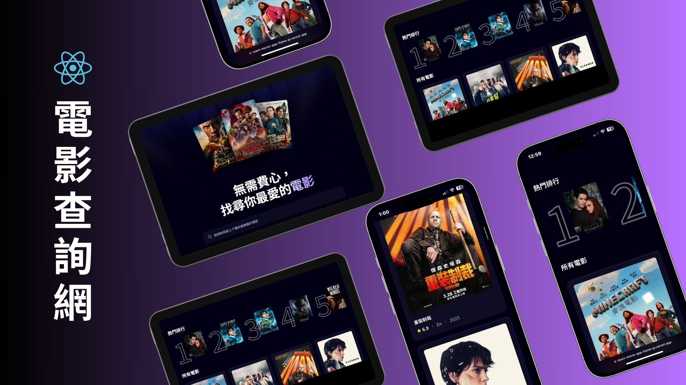

<div align="center">
  
</div>

# React Movie App

一個使用 React 和 Vite 建構的現代電影應用程式，提供直觀的使用者介面和流暢的瀏覽體驗。

## 🌟 功能特點

- 🎬 瀏覽熱門電影和最新上映電影
- 🔍 強大的電影搜尋功能
- 💫 流暢的動畫效果和現代化 UI 設計
- 📱 響應式設計，支援各種設備

## 🛠️ 使用技術

- **React 18** - 用於構建用戶界面的 JavaScript 庫
- **Vite** - 下一代前端開發與構建工具
- **Appwrite** - 後端服務集成
- **CSS3** - 實現現代化的樣式和動畫效果
- **RESTful API** - 與電影數據庫進行交互

## 🚀 快速開始

```bash
# 克隆專案
git clone [your-repo-link]

# 安裝依賴
npm install

# 啟動開發服務器
npm run dev
```

## 📸 專案截圖

[此處可以添加應用程式的截圖]

## 🔑 主要特性

- 清晰的代碼結構和模組化設計
- 使用最新的 React Hooks 和功能
- 優化的性能和加載速度
- 完整的錯誤處理和用戶反饋

## 🤝 貢獻

歡迎提出建議和改進！請隨時提交 pull request 或開啟 issue。

## 📄 授權

此專案使用 MIT 授權 - 查看 [LICENSE](LICENSE) 文件了解詳情
